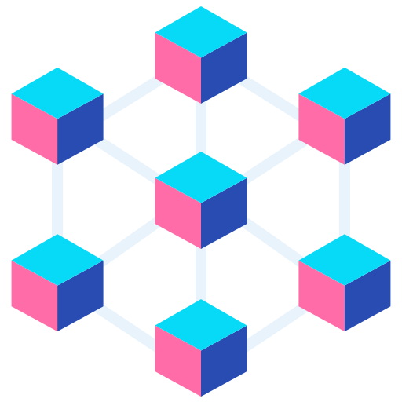

&nbsp;
&nbsp;
&nbsp;
&nbsp;
&nbsp;
&nbsp;

# Blockchain Odyssey

Welcome to the Blockchain Odyssey Repository !\
This repository is dedicated to providing resources, examples, and exercises to help you learn and master Block Chain Technology. 


## Table of Contents

1. [Introduction](#introduction)
2. [Getting Started](#getting-started)
3. [Roadmap](#roadmap)
   - [Phase 1: Introduction to Blockchain](#phase-1-introduction-to-blockchain)
   - [Phase 2: Blockchain Development Fundamentals](#phase-2-blockchain-development-fundamentals)
   - [Phase 3: Advanced Blockchain Concepts](#phase-3-advanced-blockchain-concepts)
   - [Phase 4: Practical Applications and Projects](#phase-4-practical-applications-and-projects)

4. [Contributing](#contributing)
5. [Author's Note](#authors-note)
6. [Contact](#contact)

## Introduction


.

## Getting Started

To get started with this repository, follow these steps:

1. Clone the repository to your local machine:

```  
git clone https://github.com/HarshalMPatil20/Blockchain-Odyssey  
```

2. Explore the examples, exercises, and resources provided in each directory.

3. Refer to the README files in each directory for specific instructions and guidelines.

# Blockchain Odyssey

Welcome to my Blockchain Odyssey repository! This repository documents my progress and learnings as I dive into the fascinating world of blockchain technology. Follow along as I explore the basics, advanced concepts, and practical applications of blockchain.

## Roadmap

### Phase 1: Introduction to Blockchain

#### Module 1: What is Blockchain?
* **Introduction to Blockchain**
  * Definition and Overview
  * History and Evolution
  * Key Characteristics
* **Comparison with Traditional Databases**
  * Centralized vs Decentralized Systems
  * Advantages and Disadvantages

#### Module 2: Key Concepts
* **Decentralization**
  * Importance of Decentralization
  * Examples of Decentralized Systems
* **Distributed Ledger Technology (DLT)**
  * Basics of DLT
  * How DLT Differs from Centralized Ledgers
* **Consensus Mechanisms**
  * Overview of Consensus Mechanisms
  * Proof of Work (PoW)
  * Proof of Stake (PoS)
  * Delegated Proof of Stake (DPoS)
  * Practical Byzantine Fault Tolerance (PBFT)

#### Module 3: Blockchain Basics
* **Blocks and Chains**
  * Structure of a Block
  * How Blocks Form a Chain
* **Hash Functions and Cryptography**
  * Basics of Cryptographic Hash Functions
  * Role of Hashing in Blockchain
* **Transactions and Smart Contracts**
  * How Transactions are Recorded
  * Introduction to Smart Contracts

### Phase 2: Blockchain Development Fundamentals

#### Module 4: Blockchain Architecture
* **Nodes and Network**
  * Types of Nodes (Full Nodes, Light Nodes)
  * Network Structure and Topology
* **Types of Blockchain**
  * Public Blockchain
  * Private Blockchain
  * Consortium Blockchain
  * Hybrid Blockchain

#### Module 5: Smart Contracts
* **Introduction to Smart Contracts**
  * Definition and Use Cases
  * Benefits and Limitations
* **Writing Smart Contracts with Solidity**
  * Basics of Solidity
  * Data Types, Functions, and Control Structures
  * Creating and Deploying Smart Contracts
* **Deploying Smart Contracts on Ethereum**
  * Setting Up an Ethereum Development Environment
  * Using Remix, Truffle, and Ganache
  * Interacting with Smart Contracts Using MetaMask

#### Module 6: Development Tools
* **Setting Up a Development Environment**
  * Installing and Configuring Truffle and Ganache
  * Introduction to Remix IDE
* **Working with MetaMask**
  * Setting Up MetaMask
  * Connecting to Ethereum Network
  * Managing Accounts and Transactions

### Phase 3: Advanced Blockchain Concepts

#### Module 7: Consensus Algorithms
* **Detailed Study of Various Consensus Algorithms**
  * Proof of Work (PoW)
  * Proof of Stake (PoS)
  * Delegated Proof of Stake (DPoS)
  * Practical Byzantine Fault Tolerance (PBFT)
  * Comparison and Use Cases

#### Module 8: Blockchain Scalability
* **Sharding**
  * Introduction to Sharding
  * How Sharding Improves Scalability
* **Layer 2 Solutions**
  * State Channels
  * Plasma
  * Overview and Benefits

#### Module 9: Security in Blockchain
* **Common Attacks**
  * 51% Attack
  * Sybil Attack
  * Double Spending
* **Best Practices for Secure Smart Contract Development**
  * Security Audits and Code Reviews
  * Tools for Security Analysis (MythX, Oyente)

### Phase 4: Practical Applications and Projects

#### Module 10: Building Decentralized Applications (DApps)
* **Introduction to DApps**
  * Definition and Characteristics
  * Examples of Popular DApps
* **Full-stack DApp Development**
  * Front-end Development with React.js
  * Backend Development with Ethereum Smart Contracts
  * Integration and Deployment

#### Module 11: Popular Blockchain Platforms
* **Ethereum**
  * Overview and Use Cases
  * Developing on Ethereum
* **Binance Smart Chain**
  * Overview and Use Cases
  * Developing on Binance Smart Chain
* **Polkadot**
  * Overview and Use Cases
  * Interoperability Features
* **Hyperledger Fabric**
  * Overview and Use Cases
  * Enterprise Blockchain Solutions

#### Module 12: Capstone Project
* **Developing a Complete DApp**
  * Project Planning and Idea Generation
  * Smart Contract Development
  * Front-end Integration
  * Testing and Deployment
* **Documenting and Showcasing the Project**
  * Writing Detailed Documentation
  * Creating a Demo and Presentation

## Resources

### Books
- [Mastering Bitcoin](https://github.com/bitcoinbook/bitcoinbook) by Andreas M. Antonopoulos
- [Blockchain Basics](https://www.amazon.com/Blockchain-Basics-Non-Technical-Introduction-Technology/dp/1484226038) by Daniel Drescher

### Online Courses
- [Blockchain Specialization by University at Buffalo](https://www.coursera.org/specializations/blockchain)
- [Ethereum and Solidity: The Complete Developer's Guide](https://www.udemy.com/course/ethereum-and-solidity-the-complete-developers-guide/)

### Tutorials and Articles
- [Blockchain Basics](https://www.blockchain-council.org/blockchain/blockchain-for-beginners-getting-started-guide/)
- [Solidity Documentation](https://docs.soliditylang.org/en/v0.8.6/)

## Repository Structure


&nbsp;


## Contributing

I welcome contributions from the community! If you have suggestions, improvements, or additional examples, please feel free to open an issue or submit a pull request. Your feedback and collaboration are highly appreciated : 

1. Fork the repository and create a new branch for your contributions.
2. Add your changes (code examples, documentation, etc.) to the appropriate directories.
3. Write clear and concise commit messages.
4. Submit a pull request to merge your changes into the main branch.

For more information on contributing, refer to the CONTRIBUTING.md file in this repository.

&nbsp;
## Author's Note

Thank you for visiting this Object-Oriented Programming (OOP) repository. My name is Harshal Patil, and I have created this repository to share my journey and insights into OOP concepts, design patterns, and practical implementations.

### Why This Repository?

As a passionate software developer, I believe in the power of sharing knowledge and collaborating with the community. This repository is intended to be a comprehensive resource for anyone interested in understanding and applying OOP principles in their projects. Whether you are a beginner looking to grasp the basics or an experienced developer seeking advanced techniques, I hope you find valuable information here.

### What You'll Find

In this repository, you'll discover a variety of topics related to OOP, including:

- Fundamental OOP concepts (classes, objects, inheritance, polymorphism, encapsulation, and abstraction)
- Design patterns and their implementations
- Practical examples and use cases
- Code snippets and exercises to practice OOP principles
- Additional concepts such as static and final keywords, packages, and more
- A comprehensive glossary of OOP terms and definitions
- A detailed table of contents to help you navigate the repository easily


&nbsp;


## Contact

If you have any questions, suggestions, or just want to connect, you can reach out to me via:

- Email: Harshalmpatil210@gmail.com
- GitHub Issues: [Issues Page](https://github.com/HarshalMPatil20/Blockchain-Odyssey/issues)

Thank you for your interest in this OOP repository. Happy coding!

Best regards,  
Harshal Patil

&nbsp;


<div align="center">
  <a href="harshalmpatil210@gmail.com" target="_blank">
    
  </a> &nbsp; 
  <a href="https://www.linkedin.com/in/harshal-patil-87626022a/" target="_blank">
    
  </a> &nbsp;
  <a href="discordapp.com/users/530693021193469973" target="_blank">
    
  </a> &nbsp;
  <a href="https://www.instagram.com/ll_harshal_patil_ll?igsh=OGhndmNwbjVuNHJq" target="_blank">
    
  </a> &nbsp;
</div>

